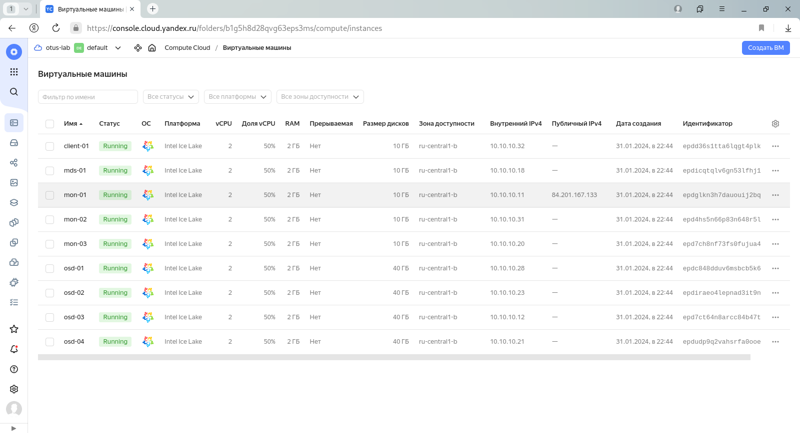

# lab-14
otus | ceph

### Домашнее задание
настройка CEPH

#### Цель:
Поднять отказоустойчивый кластер одним из способов, с фактором репликации 2 или выше, для использования rbd, cephfs, s3. 
Подключить клиентов к созданному хранилищу. Отработать сценарии сбоев.

#### Описание/Пошаговая инструкция выполнения домашнего задания:
C помощью terraform и ansible поднять отказоустойчивый кластер одним из способов, с фактором репликации 2 или выше, для использования rbd, cephfs

1. Cделать расчет кластера
2. Просчитать pg для pool'ов из расчета:
   rbd - 5/10 объема дисков
   cephfs - 3/10 объема дисков
   объяснить логику расчёта, создать пулы.
3. Создать и пробросить на клиентские машины:
   3 rbd
   cephfs (общий раздел на каждую машину)
4. Аварии и масштабирование:
   Сгенерировать split-brain, посмотреть поведение кластера, решить проблему (результат - запись консоли с выполнением)
   Сгенерировать сбой ноды с osd, вывести из кластера, добавить новую
   Сгенерировать сбой/обслуживание серверной/дата центра, проверить работоспособность сервисов (результат - запись консоли)
   Расширить кластер на 2+osd, сделать перерасчёт pg, объяснить логику
   Уменьшить кластер на 1+osd, сделать перерасчёт pg, объяснить логику

#### Формат сдачи
terraform манифесты
ansible роль (можно использовать https://github.com/ceph/ceph-ansible.git)
README.md

#### Критерии оценки:
Статус "Принято" ставится при выполнении перечисленных требований.

---

### Выполнение домашнего задания

Стенд будем разворачивать с помощью Terraform на YandexCloud, настройку серверов будем выполнять с помощью Kubernetes.

Необходимые файлы размещены в репозитории GitHub по ссылке:
```
https://github.com/SergSha/lab-14.git
```

Для начала получаем OAUTH токен:
```
https://cloud.yandex.ru/docs/iam/concepts/authorization/oauth-token
```

Настраиваем аутентификации в консоли:
```bash
export YC_TOKEN=$(yc iam create-token)
export TF_VAR_yc_token=$YC_TOKEN
```

Скачиваем проект с гитхаба:
```bash
git clone https://github.com/SergSha/lab-14.git && cd ./lab-14
```

В файле input.auto.tfvars нужно вставить свой 'cloud_id':
```bash
cloud_id  = "..."
```

Ceph кластер будем разворачивать с помощью Terraform, а все установки и настройки необходимых приложений будем реализовывать с помощью Ansible.

Для того чтобы развернуть ceph кластер, нужно выполнить следующую команду:
```bash
terraform init && terraform apply -auto-approve && \
sleep 60 && ansible-playbook ./provision.yml
```

По завершению команды получим данные outputs:
```
Outputs:

client-info = {
  "client-01" = {
    "ip_address" = tolist([
      "10.10.10.23",
    ])
    "nat_ip_address" = tolist([
      "",
    ])
  }
}
mds-info = {
  "mds-01" = {
    "ip_address" = tolist([
      "10.10.10.3",
    ])
    "nat_ip_address" = tolist([
      "",
    ])
  }
}
mon-info = {
  "mon-01" = {
    "ip_address" = tolist([
      "10.10.10.35",
    ])
    "nat_ip_address" = tolist([
      "158.160.4.48",
    ])
  }
  "mon-02" = {
    "ip_address" = tolist([
      "10.10.10.25",
    ])
    "nat_ip_address" = tolist([
      "",
    ])
  }
  "mon-03" = {
    "ip_address" = tolist([
      "10.10.10.28",
    ])
    "nat_ip_address" = tolist([
      "",
    ])
  }
}
osd-info = {
  "osd-01" = {
    "ip_address" = tolist([
      "10.10.10.9",
    ])
    "nat_ip_address" = tolist([
      "",
    ])
  }
  "osd-02" = {
    "ip_address" = tolist([
      "10.10.10.24",
    ])
    "nat_ip_address" = tolist([
      "",
    ])
  }
  "osd-03" = {
    "ip_address" = tolist([
      "10.10.10.19",
    ])
    "nat_ip_address" = tolist([
      "",
    ])
  }
  "osd-04" = {
    "ip_address" = tolist([
      "10.10.10.4",
    ])
    "nat_ip_address" = tolist([
      "",
    ])
  }
}
```

На всех серверах будут установлены ОС Almalinux 9, настроены синхронизация времени Chrony, система принудительного контроля доступа SELinux, в качестве firewall будет использоваться NFTables.

Список виртуальных машин после запуска стенда:



Ceph кластер будет состоять из следующих серверов:
- мониторы (тут же и менеджеры): mon-01, mon-02, mon-03;
- сервер метаданных: mds-01;
- OSD: osd-01, osd-02, osd-03.

Также будут подготовлены:
- клиентский сервер client-01 для подключения к ceph кластеру;
- сервер osd-04 для замены одного из osd серверов.

Все osd сервера имеют по три дополнительных диска по 10 ГБ:
- vdb, vdc - которые будут включены в кластер во время разворачивания;
- vdd - для дополнительного включения в кластер при выполнении лабораторной работы.

Если в строке браузера введём следующую строку:
```
https://158.160.4.48:8443
```

то получим страницу Ceph Dashbooard:


В дальнейшем все команды будем выполнять на сервере mon-01, поэтому подключимся к этому серверу с помощью ssh, имея публичный адрес, полученный во время разворачивания инфраструктуры ceph кластера:
```bash
ssh almalinux@158.160.4.48
```
```
(.venv) [user@redos lab-14]$ ssh almalinux@158.160.4.48
Last login: Tue Jan 30 20:55:15 2024 from 10.10.10.35
[almalinux@mon-01 ~]$ sudo -i
[root@mon-01 ~]# 
```

Просчитать pg для pool'ов:
rbd - 5/10 объема дисков 
cephfs - 3/10 объема дисков 
объяснить логику расчёта, создать пулы.

Формула для расчета: 
```
Total PGs = (Total_number_of_OSD * %_data * Target_PGs_per_OSD) / max_replication_count

Total_number_of_OSD - количество OSDs, в которых этот пул будет иметь PGS. Обычно это количество OSDs всего кластера, но может быть меньше в зависимости от правил CRUSH. (например, отдельные наборы дисков SSD и SATA)

%_data - это значение представляет приблизительный процент данных, которые будут содержаться в этом пуле для данного конкретного OSDs. 

Target PGs per OSD - это значение должно быть заполнено на основе следующего указания:
    100 - если количество OSDs кластера, как ожидается, не увеличится в обозримом будущем.
    200 - если ожидается, что количество OSDs кластера увеличится (до удвоения размера) в обозримом будущем.
    300 - если ожидается, что количество OSDs кластера увеличится в 2-3 раза в обозримом будущем.

max_replication_count - количество реплик, которые будут находиться в пуле. Значение, по умолчанию, равно 3.
```

Для 6 osd (с дисками по 10 Гб) получаем:

Для RBD: 
```
total PGs = (6 * 5/10 * 100) / 3 = 100 => 128 pg
```

Создаем пул myrbd: 
```bash
ceph osd pool create myrbd 128
ceph osd pool set myrbd size 3
ceph osd pool application enable myrbd rbd
```
```
[root@mon-01 ~]# ceph osd pool create myrbd 128
pool 'myrbd' created
[root@mon-01 ~]# ceph osd pool set myrbd size 3
set pool 2 size to 3
[root@mon-01 ~]# ceph osd pool application enable myrbd rbd
enabled application 'rbd' on pool 'myrbd'
[root@mon-01 ~]# 
```

Для cephfs: 
```
total PGs = (6 * 3/10 * 100) / 3 = 60 => 64 pg
```

Создаем пул для данных cephfs_data: 
```bash
ceph osd pool create cephfs_data 64
ceph osd pool set cephfs_data size 3
```
```
[root@mon-01 ~]# ceph osd pool create cephfs_data 64
pool 'cephfs_data' created
[root@mon-01 ~]# ceph osd pool set cephfs_data size 3
set pool 3 size to 3
[root@mon-01 ~]# 
```

и для метаданных cephfs_meta: 
```bash
ceph osd pool create cephfs_meta 64
ceph osd pool set cephfs_meta size 3
```
```
[root@mon-01 ~]# ceph osd pool create cephfs_meta 64
pool 'cephfs_meta' created
[root@mon-01 ~]# ceph osd pool set cephfs_meta size 3
set pool 4 size to 3
[root@mon-01 ~]# 
```

#### RBD
Создать и пробросить на клиентские машины 3 rbd 

Создадим 3 rbd диска:
```bash
rbd create disk1 --size 1G --pool myrbd
rbd create disk2 --size 2G --pool myrbd
rbd create disk3 --size 3G --pool myrbd
```
```
[root@mon-01 ~]# rbd create disk1 --size 1G --pool myrbd
[root@mon-01 ~]# rbd create disk2 --size 2G --pool myrbd
[root@mon-01 ~]# rbd create disk3 --size 3G --pool myrbd
[root@mon-01 ~]# rbd ls --pool myrbd
disk1
disk2
disk3
[root@mon-01 ~]# 
```

С клиентской машины client-01 осуществим подключение к ceph кластеру.

Скопируем ceph конфиг файл ceph.conf и ключ ceph.client.admin.keyring на клиентскую машину client-01:
```
[root@mon-01 ~]# scp /etc/ceph/{ceph.client.admin.keyring,ceph.conf} almalinux@client-01:/tmp/
ceph.client.admin.keyring                     100%  151   419.8KB/s   00:00    
ceph.conf                                     100%  265   894.2KB/s   00:00    
[root@mon-01 ~]# 
```

Подключимся к клиентской машине client-01 с помощью ssh и из директории /tmp перенесём ceph.conf и ключ ceph.client.admin.keyring в /etc/ceph/:
```
[root@mon-01 ~]# ssh almalinux@client-01
Last login: Tue Jan 30 20:51:11 2024 from 10.10.10.35
[almalinux@client-01 ~]$ sudo -i
[root@client-01 ~]# mv /tmp/{ceph.client.admin.keyring,ceph.conf} /etc/ceph/
[root@client-01 ~]# 
```
Ceph конфиг файл ceph.conf выглядит следующим образом:
```
[root@client-01 ~]# cat /etc/ceph/ceph.conf 
# minimal ceph.conf for 2c745bde-bf98-11ee-9416-d00d3f30ed62
[global]
	fsid = 2c745bde-bf98-11ee-9416-d00d3f30ed62
	mon_host = [v2:10.10.10.35:3300/0,v1:10.10.10.35:6789/0] [v2:10.10.10.25:3300/0,v1:10.10.10.25:6789/0] [v2:10.10.10.28:3300/0,v1:10.10.10.28:6789/0]
```

Ключ клиента ceph.client.admin.keyring выглядит подобным образом:
```
[root@client-01 ~]# cat /etc/ceph/ceph.client.admin.keyring 
[client.admin]
	key = AQCkN7llzOPQLBAASG3av2VRB5RvegxnpOlCSQ==
	caps mds = "allow *"
	caps mgr = "allow *"
	caps mon = "allow *"
	caps osd = "allow *"
```

Подключим блочное устройство, например, disk3 к клиенту:
```bash
rbd device map myrbd/disk3
```
```
[root@client-01 ~]# rbd device map myrbd/disk3
/dev/rbd0
[root@client-01 ~]# rbd showmapped
id  pool   namespace  image  snap  device   
0   myrbd             disk3  -     /dev/rbd0
[root@client-01 ~]# 
```

Создадим файловую систему и смонтируем устройство:
```bash
mkfs.xfs /dev/rbd/myrbd/disk3
```
```
[root@client-01 ~]# mkfs.xfs /dev/rbd/myrbd/disk3
meta-data=/dev/rbd/myrbd/disk3   isize=512    agcount=8, agsize=98304 blks
         =                       sectsz=512   attr=2, projid32bit=1
         =                       crc=1        finobt=1, sparse=1, rmapbt=0
         =                       reflink=1    bigtime=1 inobtcount=1 nrext64=0
data     =                       bsize=4096   blocks=786432, imaxpct=25
         =                       sunit=16     swidth=16 blks
naming   =version 2              bsize=4096   ascii-ci=0, ftype=1
log      =internal log           bsize=4096   blocks=16384, version=2
         =                       sectsz=512   sunit=16 blks, lazy-count=1
realtime =none                   extsz=4096   blocks=0, rtextents=0
Discarding blocks...Done.
[root@client-01 ~]# 
```

Создадим директорий для монтирования:
```bash
mkdir /mnt/ceph_rbd
```
```
[root@client-01 ~]# mkdir /mnt/ceph_rbd
[root@client-01 ~]# 
```
Смонтируем файловую систему:
```bash
mount -t xfs /dev/rbd/myrbd/disk3 /mnt/ceph_rbd/
```
```
[root@client-01 ~]# mount -t xfs /dev/rbd/myrbd/disk3 /mnt/ceph_rbd/
[root@client-01 ~]# df -h | grep rbd
/dev/rbd0       3.0G   54M  2.9G   2% /mnt/ceph_rbd
[root@client-01 ~]# 
```

Автоматизируем данный процесс, но предварительно отмонтируем устройство:
```bash
umount /mnt/ceph_rbd/
rbd unmap /dev/rbd0
rbd showmapped
```
```
[root@client-01 ~]# umount /mnt/ceph_rbd/
[root@client-01 ~]# rbd unmap /dev/rbd0
[root@client-01 ~]# rbd showmapped
[root@client-01 ~]# 
```

Для автоматического подключения RBD устройств воспользуемся службой rbdmap, которая использует файл /etc/ceph/rbdmap и подключает все устройства, прописанные в данном файле.

Отредактируем файл /etc/ceph/rbdmap:
```bash
echo "myrbd/disk3             id=admin,keyring=/etc/ceph/ceph.client.admin.keyring" >> /etc/ceph/rbdmap
```
```
[root@client-01 ~]# echo "myrbd/disk3             id=admin,keyring=/etc/ceph/ceph.client.admin.keyring" >> /etc/ceph/rbdmap 
[root@client-01 ~]# cat /etc/ceph/rbdmap
# RbdDevice		      Parameters
#poolname/imagename	id=client,keyring=/etc/ceph/ceph.client.keyring
myrbd/disk3          id=admin,keyring=/etc/ceph/ceph.client.admin.keyring  #<--- добавлена строка
```

Добавим службу rbdmap в автозагрузку и сразу же запустим:
```bash
systemctl enable --now rbdmap
```
```
[root@client-01 ~]# systemctl enable --now rbdmap
Created symlink /etc/systemd/system/multi-user.target.wants/rbdmap.service → /usr/lib/systemd/system/rbdmap.service.
[root@client-01 ~]# rbd showmapped
id  pool   namespace  image  snap  device   
0   myrbd             disk3  -     /dev/rbd0
[root@client-01 ~]# 
```

Подправим fstab, для автоматического монтирования после перезагрузки ОС:
```bash
echo "/dev/rbd/myrbd/disk3                      /mnt/ceph_rbd           xfs     _netdev         0 0" >> /etc/fstab
```
```
[root@client-01 ~]# echo "/dev/rbd/myrbd/disk3                      /mnt/ceph_rbd           xfs     _netdev         0 0" >> /etc/fstab
[root@client-01 ~]# cat /etc/fstab 

#
# /etc/fstab
# Created by anaconda on Wed Nov  9 10:15:27 2022
#
# Accessible filesystems, by reference, are maintained under '/dev/disk/'.
# See man pages fstab(5), findfs(8), mount(8) and/or blkid(8) for more info.
#
# After editing this file, run 'systemctl daemon-reload' to update systemd
# units generated from this file.
#
UUID=ceb11787-f80b-4377-859f-a83f14385537 /                       xfs     defaults        0 0
/dev/rbd/myrbd/disk3                      /mnt/ceph_rbd           xfs     _netdev         0 0  #<--- добавлена строка
```

#### Cephfs
Создать и пробросить на клиентские машины cephfs (общий раздел на каждую машину)

Создадим файловую систему cephfs, для этого на сервере mon-01 выполним следующую команду:
```bash
ceph fs new cephfs cephfs_meta cephfs_data
```
```
[root@mon-01 ~]# ceph fs new cephfs cephfs_meta cephfs_data
  Pool 'cephfs_data' (id '3') has pg autoscale mode 'on' but is not marked as bulk.
  Consider setting the flag by running
    # ceph osd pool set cephfs_data bulk true
new fs with metadata pool 4 and data pool 3
[root@mon-01 ~]# 
```
```
[root@mon-01 ~]# ceph fs ls
name: cephfs, metadata pool: cephfs_meta, data pools: [cephfs_data ]
[root@mon-01 ~]# 
```

На клиентской машине client-01 cоздадим директорий для монтирования файловой системы cephfs:
```bash
mkdir /mnt/cephfs
```
```
[root@client-01 ~]# mkdir /mnt/cephfs
[root@client-01 ~]# 
```

Получим fsid ceph кластера:
```bash
ceph fsid
```
```
[root@client-01 ~]# ceph fsid
2c745bde-bf98-11ee-9416-d00d3f30ed62
[root@client-01 ~]# 
```

Смонтируем файловую систему cephfs:
```bash
mount.ceph admin@2c745bde-bf98-11ee-9416-d00d3f30ed62.cephfs=/ /mnt/cephfs/
```
```
[root@client-01 ~]# mount.ceph admin@0120dc54-bf67-11ee-9c79-d00d151775b8.cephfs=/ /mnt/cephfs/
[root@client-01 ~]# df -h | grep cephfs
admin@2c745bde-bf98-11ee-9416-d00d3f30ed62.cephfs=/   19G     0   19G   0% /mnt/cephfs
[root@client-01 ~]# 
```

Для наглядности на каждом из монтированных файловых систем ceph создадим по текстовому файлу:
```bash
echo "Hello RBD" > /mnt/ceph_rbd/rbd.txt
echo "Hello CephFS" > /mnt/cephfs/cephfs.txt
```
```
[root@client-01 ~]# echo "Hello RBD" > /mnt/ceph_rbd/rbd.txt
[root@client-01 ~]# cat /mnt/ceph_rbd/rbd.txt 
Hello RBD
[root@client-01 ~]# echo "Hello CephFS" > /mnt/cephfs/cephfs.txt
[root@client-01 ~]# cat /mnt/cephfs/cephfs.txt 
Hello CephFS
[root@client-01 ~]# 
```

#### Сгенерировать сбой ноды с osd, вывести из кластера, добавить новую

Сначала посмотрим состояние ceph кластера:
```bash
ceph -s
```
```
[root@mon-01 ~]# ceph -s
  cluster:
    id:     2c745bde-bf98-11ee-9416-d00d3f30ed62
    health: HEALTH_OK
 
  services:
    mon: 3 daemons, quorum mon-01,mon-03,mon-02 (age 37m)
    mgr: mon-01.hdggnk(active, since 40m), standbys: mon-03.fwckkp, mon-02.sjnxoz
    mds: 1/1 daemons up
    osd: 6 osds: 6 up (since 36m), 6 in (since 37m)
 
  data:
    volumes: 1/1 healthy
    pools:   4 pools, 113 pgs
    objects: 45 objects, 6.8 MiB
    usage:   475 MiB used, 60 GiB / 60 GiB avail
    pgs:     113 active+clean
 
[root@mon-01 ~]# 
```

Для отслеживания изменения состояния ceph кластера в другом терминале запустим команду:
```bash
ceph -w
```
```
[root@mon-01 ~]# ceph -w
  cluster:
    id:     0120dc54-bf67-11ee-9c79-d00d151775b8
    health: HEALTH_OK
 
  services:
    mon: 3 daemons, quorum mon-01,mon-03,mon-02 (age 106m)
    mgr: mon-01.duszzi(active, since 110m), standbys: mon-03.rrskxv, mon-02.cjmoqm
    mds: 1/1 daemons up
    osd: 6 osds: 6 up (since 105m), 6 in (since 106m)
 
  data:
    volumes: 1/1 healthy
    pools:   4 pools, 113 pgs
    objects: 45 objects, 6.8 MiB
    usage:   475 MiB used, 60 GiB / 60 GiB avail
    pgs:     113 active+clean
 


```

Отключим один из серверов osd, например, osd-01:


Отображение Ceph Dashboard:


В текущем окне терминала проверим промежуточное состояние ceph кластера:
```
[root@mon-01 ~]# ceph health
HEALTH_WARN 2 osds down; 1 host (2 osds) down; Degraded data redundancy: 45/135 objects degraded (33.333%), 29 pgs degraded, 113 pgs undersized
[root@mon-01 ~]# 
```

```
[root@mon-01 ~]# ceph -s
  cluster:
    id:     2c745bde-bf98-11ee-9416-d00d3f30ed62
    health: HEALTH_WARN
            2 osds down
            1 host (2 osds) down
            Degraded data redundancy: 45/135 objects degraded (33.333%), 29 pgs degraded, 113 pgs undersized
 
  services:
    mon: 3 daemons, quorum mon-01,mon-03,mon-02 (age 65m)
    mgr: mon-01.hdggnk(active, since 68m), standbys: mon-03.fwckkp, mon-02.sjnxoz
    mds: 1/1 daemons up
    osd: 6 osds: 4 up (since 4m), 6 in (since 64m)
 
  data:
    volumes: 1/1 healthy
    pools:   4 pools, 113 pgs
    objects: 45 objects, 6.8 MiB
    usage:   475 MiB used, 60 GiB / 60 GiB avail
    pgs:     45/135 objects degraded (33.333%)
             84 active+undersized
             29 active+undersized+degraded
 
[root@mon-01 ~]# 
```

```
[root@mon-01 ~]# ceph orch host ls
HOST                ADDR         LABELS  STATUS   
mds-01.example.com  10.10.10.3                    
mon-01.example.com  10.10.10.35  _admin           
mon-02.example.com  10.10.10.25                   
mon-03.example.com  10.10.10.28                   
osd-01.example.com  10.10.10.9           Offline  
osd-02.example.com  10.10.10.24                   
osd-03.example.com  10.10.10.19                   
7 hosts in cluster
[root@mon-01 ~]# 
```

```
[root@mon-01 ~]# ceph osd df
ID  CLASS  WEIGHT   REWEIGHT  SIZE    RAW USE  DATA     OMAP  META     AVAIL    %USE  VAR   PGS  STATUS
 1    hdd  0.00980   1.00000  10 GiB   78 MiB  8.9 MiB   0 B   69 MiB  9.9 GiB  0.76  0.99    0    down
 3    hdd  0.00980   1.00000  10 GiB   80 MiB   11 MiB   0 B   69 MiB  9.9 GiB  0.78  1.01    0    down
 0    hdd  0.00980   1.00000  10 GiB   80 MiB   11 MiB   0 B   69 MiB  9.9 GiB  0.79  1.02   57      up
 4    hdd  0.00980   1.00000  10 GiB   78 MiB  8.6 MiB   0 B   69 MiB  9.9 GiB  0.76  0.98   56      up
 2    hdd  0.00980   1.00000  10 GiB   80 MiB   11 MiB   0 B   69 MiB  9.9 GiB  0.78  1.01   54      up
 5    hdd  0.00980   1.00000  10 GiB   78 MiB  8.9 MiB   0 B   69 MiB  9.9 GiB  0.76  0.99   59      up
                       TOTAL  60 GiB  475 MiB   59 MiB   0 B  416 MiB   60 GiB  0.77                   
MIN/MAX VAR: 0.98/1.02  STDDEV: 0.01
[root@mon-01 ~]# 
```

Так как хост osd-01 отключен, исключим его из ceph кластера:
```bash
ceph orch host rm osd-01 --force
```
```
[root@mon-01 ~]# ceph orch host rm osd-01 --force
Removed  host 'osd-01'
[root@mon-01 ~]# 
```

```
[root@mon-01 ~]# ceph orch host ls
HOST                ADDR         LABELS  STATUS  
mds-01.example.com  10.10.10.3                   
mon-01.example.com  10.10.10.35  _admin          
mon-02.example.com  10.10.10.25                  
mon-03.example.com  10.10.10.28                  
osd-02.example.com  10.10.10.24                  
osd-03.example.com  10.10.10.19                  
6 hosts in cluster
[root@mon-01 ~]# 
```


```bash
ceph osd crush rm osd.1
ceph osd crush rm osd.3
```

```
[root@mon-01 ~]# ceph osd crush rm osd.1
removed item id 1 name 'osd.1' from crush map
[root@mon-01 ~]# 
[root@mon-01 ~]# ceph osd crush rm osd.3
removed item id 3 name 'osd.3' from crush map
[root@mon-01 ~]# 
```

```
[root@mon-01 ~]# ceph osd df
ID  CLASS  WEIGHT   REWEIGHT  SIZE    RAW USE  DATA     OMAP  META     AVAIL    %USE  VAR   PGS  STATUS
 0    hdd  0.00980   1.00000  10 GiB   81 MiB   11 MiB   0 B   69 MiB  9.9 GiB  0.79  1.01   65      up
 4    hdd  0.00980   1.00000  10 GiB   79 MiB  9.1 MiB   0 B   69 MiB  9.9 GiB  0.77  0.99   67      up
 2    hdd  0.00980   1.00000  10 GiB   80 MiB   11 MiB   0 B   69 MiB  9.9 GiB  0.78  1.01   64      up
 5    hdd  0.00980   1.00000  10 GiB   78 MiB  9.0 MiB   0 B   69 MiB  9.9 GiB  0.77  0.99   62      up
 1               0         0     0 B      0 B      0 B   0 B      0 B      0 B     0     0    0    down
 3               0         0     0 B      0 B      0 B   0 B      0 B      0 B     0     0    0    down
                       TOTAL  40 GiB  318 MiB   40 MiB   0 B  278 MiB   40 GiB  0.78                   
MIN/MAX VAR: 0.99/1.01  STDDEV: 0.01
[root@mon-01 ~]# 
```


```bash
ceph osd purge osd.1 --yes-i-really-mean-it
ceph osd purge osd.3 --yes-i-really-mean-it
```
```
[root@mon-01 ~]# ceph osd purge osd.1 --yes-i-really-mean-it
purged osd.1
[root@mon-01 ~]# ceph osd purge osd.3 --yes-i-really-mean-it
purged osd.3
[root@mon-01 ~]# ceph osd df
ID  CLASS  WEIGHT   REWEIGHT  SIZE    RAW USE  DATA     OMAP  META     AVAIL    %USE  VAR   PGS  STATUS
 0    hdd  0.00980   1.00000  10 GiB   81 MiB   11 MiB   0 B   69 MiB  9.9 GiB  0.79  1.01   65      up
 4    hdd  0.00980   1.00000  10 GiB   79 MiB  9.2 MiB   0 B   69 MiB  9.9 GiB  0.77  0.99   67      up
 2    hdd  0.00980   1.00000  10 GiB   80 MiB   11 MiB   0 B   69 MiB  9.9 GiB  0.78  1.01   64      up
 5    hdd  0.00980   1.00000  10 GiB   78 MiB  9.0 MiB   0 B   69 MiB  9.9 GiB  0.77  0.99   62      up
                       TOTAL  40 GiB  318 MiB   40 MiB   0 B  278 MiB   40 GiB  0.78                   
MIN/MAX VAR: 0.99/1.01  STDDEV: 0.01
[root@mon-01 ~]# 
```

```bash
ceph auth del osd.1
ceph auth del osd.3
```
```
[root@mon-01 ~]# ceph auth del osd.1
[root@mon-01 ~]# ceph auth del osd.3
[root@mon-01 ~]# 
```

Add osd-04.example.com:
```bash
ceph orch host add osd-04.example.com
```
```
[root@mon-01 ~]# ceph orch host add osd-04.example.com
Added host 'osd-04.example.com' with addr '10.10.10.4'
[root@mon-01 ~]# 
```

```
[root@mon-01 ~]# ceph orch host ls
HOST                ADDR         LABELS  STATUS  
mds-01.example.com  10.10.10.3                   
mon-01.example.com  10.10.10.35  _admin          
mon-02.example.com  10.10.10.25                  
mon-03.example.com  10.10.10.28                  
osd-02.example.com  10.10.10.24                  
osd-03.example.com  10.10.10.19                  
osd-04.example.com  10.10.10.4    #<--- добавлен новый osd хост
7 hosts in cluster
[root@mon-01 ~]# 
```

Добавим диски vdb и vdc:
```bash
ceph orch daemon add osd osd-04.example.com:/dev/vdb
ceph orch daemon add osd osd-04.example.com:/dev/vdc
```
```
[root@mon-01 ~]# ceph orch daemon add osd osd-04.example.com:/dev/vdb
[root@mon-01 ~]# ceph orch daemon add osd osd-04.example.com:/dev/vdc
[root@mon-01 ~]# 
```


```
[root@mon-01 ~]# ceph df
--- RAW STORAGE ---
CLASS    SIZE   AVAIL     USED  RAW USED  %RAW USED
hdd    40 GiB  40 GiB  317 MiB   317 MiB       0.77
TOTAL  40 GiB  40 GiB  317 MiB   317 MiB       0.77
 
--- POOLS ---
POOL         ID  PGS   STORED  OBJECTS     USED  %USED  MAX AVAIL
.mgr          1    1  673 KiB        2  1.3 MiB      0     28 GiB
myrbd         2   32  3.7 MiB       20  7.5 MiB   0.01     28 GiB
cephfs_data   3   64     19 B        1   12 KiB      0     28 GiB
cephfs_meta   4   16  9.3 KiB       22  108 KiB      0     28 GiB
[root@mon-01 ~]# 
```

```
[root@mon-01 ~]# ceph orch device ls
HOST                PATH      TYPE  DEVICE ID              SIZE  AVAILABLE  REFRESHED  REJECT REASONS                                                           
osd-01.example.com  /dev/vdb  hdd   epd9n7a3q1bfnkgehkvs  10.0G  No         59m ago    Has a FileSystem, Insufficient space (<10 extents) on vgs, LVM detected  
osd-01.example.com  /dev/vdc  hdd   epda6uu9fqmphgqd2h6v  10.0G  No         59m ago    Has a FileSystem, Insufficient space (<10 extents) on vgs, LVM detected  
osd-01.example.com  /dev/vdd  hdd   epdqhj553mmlu8el7shh  10.0G  Yes        59m ago                                                                             
osd-02.example.com  /dev/vdb  hdd   epduda84dd22iemrntq9  10.0G  No         27m ago    Has a FileSystem, Insufficient space (<10 extents) on vgs, LVM detected  
osd-02.example.com  /dev/vdc  hdd   epdullidt0hkd8u82h0j  10.0G  No         27m ago    Has a FileSystem, Insufficient space (<10 extents) on vgs, LVM detected  
osd-02.example.com  /dev/vdd  hdd   epdeuuvg7s050kogpkp0  10.0G  Yes        27m ago                                                                             
osd-03.example.com  /dev/vdb  hdd   epdkce6tict29bchgvov  10.0G  No         27m ago    Has a FileSystem, Insufficient space (<10 extents) on vgs, LVM detected  
osd-03.example.com  /dev/vdc  hdd   epdubtv3k7v6guk38i9h  10.0G  No         27m ago    Has a FileSystem, Insufficient space (<10 extents) on vgs, LVM detected  
osd-03.example.com  /dev/vdd  hdd   epdi14atfqeemsjbjf5t  10.0G  Yes        27m ago                                                                             
[root@mon-01 ~]# 
```


---
```bash
ceph osd pool create myrbd 128
ceph osd pool set myrbd size 3
ceph osd pool application enable myrbd rbd

ceph osd pool create cephfs_data 64
ceph osd pool set cephfs_data size 3
ceph osd pool create cephfs_meta 64
ceph osd pool set cephfs_meta size 3
ceph osd pool set cephfs_data bulk true

rbd create disk1 --size 1G --pool myrbd
rbd create disk2 --size 2G --pool myrbd
rbd create disk3 --size 3G --pool myrbd

ceph fs new cephfs cephfs_meta cephfs_data
```

На клиентской машине:
```bash
rbd device map myrbd/disk3
mkfs.xfs /dev/rbd/myrbd/disk3
mkdir /mnt/ceph_rbd
mount -t xfs /dev/rbd/myrbd/disk3 /mnt/ceph_rbd/

mkdir /mnt/cephfs
mount.ceph admin@$(ceph fsid).cephfs=/ /mnt/cephfs/
echo "Hello RBD" > /mnt/ceph_rbd/rbd.txt
echo "Hello CephFS" > /mnt/cephfs/cephfs.txt
cat /mnt/ceph_rbd/rbd.txt 
cat /mnt/cephfs/cephfs.txt
```
---


[root@mon-01 ~]# ceph osd tree
ID  CLASS  WEIGHT   TYPE NAME        STATUS  REWEIGHT  PRI-AFF
-1         0.05878  root default                              
-5         0.01959      host osd-01                           
 2    hdd  0.00980          osd.2        up   1.00000  1.00000
 4    hdd  0.00980          osd.4        up   1.00000  1.00000
-3         0.01959      host osd-02                           
 0    hdd  0.00980          osd.0        up   1.00000  1.00000
 3    hdd  0.00980          osd.3        up   1.00000  1.00000
-7         0.01959      host osd-03                           
 1    hdd  0.00980          osd.1        up   1.00000  1.00000
 5    hdd  0.00980          osd.5        up   1.00000  1.00000
[root@mon-01 ~]# 


[root@mon-01 ~]# ceph osd tree
ID  CLASS  WEIGHT   TYPE NAME        STATUS  REWEIGHT  PRI-AFF
-1         0.05878  root default                              
-5         0.01959      host osd-01                           
 2    hdd  0.00980          osd.2      down   1.00000  1.00000
 4    hdd  0.00980          osd.4      down   1.00000  1.00000
-3         0.01959      host osd-02                           
 0    hdd  0.00980          osd.0        up   1.00000  1.00000
 3    hdd  0.00980          osd.3        up   1.00000  1.00000
-7         0.01959      host osd-03                           
 1    hdd  0.00980          osd.1        up   1.00000  1.00000
 5    hdd  0.00980          osd.5        up   1.00000  1.00000
[root@mon-01 ~]# 


[root@mon-01 ~]# ceph osd out osd.2
marked out osd.2. 
[root@mon-01 ~]# ceph osd out osd.4
marked out osd.4. 
[root@mon-01 ~]# 


[root@mon-01 ~]# ceph osd down osd.2
osd.2 is already down. 
[root@mon-01 ~]# ceph osd down osd.4
osd.4 is already down. 
[root@mon-01 ~]# 


[root@mon-01 ~]# ceph osd rm osd.2
removed osd.2
[root@mon-01 ~]# ceph osd rm osd.4
removed osd.4
[root@mon-01 ~]# 


[root@mon-01 ~]# ceph osd crush rm osd.2
removed item id 2 name 'osd.2' from crush map
[root@mon-01 ~]# ceph osd crush rm osd.4
removed item id 4 name 'osd.4' from crush map
[root@mon-01 ~]# 


[root@mon-01 ~]# ceph auth del osd.2
[root@mon-01 ~]# ceph auth del osd.4
[root@mon-01 ~]# 


[root@mon-01 ~]# ceph osd destroy 2 --yes-i-really-mean-it
osd.2 does not exist
[root@mon-01 ~]# ceph osd destroy 4 --yes-i-really-mean-it
osd.4 does not exist
[root@mon-01 ~]# 


[root@mon-01 ~]# ceph -s
  cluster:
    id:     e57803a8-bffa-11ee-9484-d00d101a26da
    health: HEALTH_WARN
            Degraded data redundancy: 33/135 objects degraded (24.444%), 19 pgs degraded, 218 pgs undersized
 
  services:
    mon: 3 daemons, quorum mon-01,mon-03,mon-02 (age 2m)
    mgr: mon-01.yjbfsu(active, since 44m), standbys: mon-03.tskoha, mon-02.ecbmlu
    mds: 1/1 daemons up
    osd: 4 osds: 4 up (since 11m), 4 in (since 10m); 87 remapped pgs
 
  data:
    volumes: 1/1 healthy
    pools:   4 pools, 305 pgs
    objects: 45 objects, 6.8 MiB
    usage:   308 MiB used, 40 GiB / 40 GiB avail
    pgs:     33/135 objects degraded (24.444%)
             12/135 objects misplaced (8.889%)
             199 active+undersized
             87  active+clean+remapped
             19  active+undersized+degraded
 
[root@mon-01 ~]# 


[root@mon-01 ~]# ceph orch host add osd-04.example.com
Added host 'osd-04.example.com' with addr '10.10.10.23'
[root@mon-01 ~]# 


[root@mon-01 ~]# ceph orch daemon add osd osd-04.example.com:/dev/vdb
Created osd(s) 2,4 on host 'osd-04.example.com'
[root@mon-01 ~]# ceph orch daemon add osd osd-04.example.com:/dev/vdc
Created no osd(s) on host osd-04.example.com; already created?
[root@mon-01 ~]# 


[root@mon-01 ~]# ceph osd tree
ID  CLASS  WEIGHT   TYPE NAME        STATUS  REWEIGHT  PRI-AFF
-1         0.05878  root default                              
-5               0      host osd-01                           
-3         0.01959      host osd-02                           
 0    hdd  0.00980          osd.0        up   1.00000  1.00000
 3    hdd  0.00980          osd.3        up   1.00000  1.00000
-7         0.01959      host osd-03                           
 1    hdd  0.00980          osd.1        up   1.00000  1.00000
 5    hdd  0.00980          osd.5        up   1.00000  1.00000
-9         0.01959      host osd-04                           
 2    hdd  0.00980          osd.2        up   1.00000  1.00000
 4    hdd  0.00980          osd.4        up   1.00000  1.00000
[root@mon-01 ~]# 


[root@mon-01 ~]# ceph orch host ls
HOST                ADDR         LABELS  STATUS   
mds-01.example.com  10.10.10.22                   
mon-01.example.com  10.10.10.8   _admin           
mon-02.example.com  10.10.10.16                   
mon-03.example.com  10.10.10.19                   
osd-01.example.com  10.10.10.14          Offline  
osd-02.example.com  10.10.10.26                   
osd-03.example.com  10.10.10.9                    
osd-04.example.com  10.10.10.23                   
8 hosts in cluster
[root@mon-01 ~]# 


[root@mon-01 ~]# ceph orch host drain osd-01.example.com
Scheduled to remove the following daemons from host 'osd-01.example.com'
type                 id             
-------------------- ---------------
ceph-exporter        osd-01         
crash                osd-01         
node-exporter        osd-01         
[root@mon-01 ~]# 


НЕ НУЖНО!!!
[root@mon-01 ~]# ceph orch host maintenance enter osd-01.example.com
Daemons for Ceph cluster e57803a8-bffa-11ee-9484-d00d101a26da stopped on host osd-01.example.com. Host osd-01.example.com moved to maintenance mode
[root@mon-01 ~]# 


[root@mon-01 ~]# ceph orch host rm osd-01.example.com --offline --force
Removed offline host 'osd-01.example.com'
[root@mon-01 ~]# 


[root@mon-01 ~]# ceph orch host ls
HOST                ADDR         LABELS  STATUS  
mds-01.example.com  10.10.10.22                  
mon-01.example.com  10.10.10.8   _admin          
mon-02.example.com  10.10.10.16                  
mon-03.example.com  10.10.10.19                  
osd-02.example.com  10.10.10.26                  
osd-03.example.com  10.10.10.9                   
osd-04.example.com  10.10.10.23                  
7 hosts in cluster
[root@mon-01 ~]# 


[root@mon-01 ~]# ceph osd tree
ID  CLASS  WEIGHT   TYPE NAME        STATUS  REWEIGHT  PRI-AFF
-1         0.05878  root default                              
-5               0      host osd-01                           
-3         0.01959      host osd-02                           
 0    hdd  0.00980          osd.0        up   1.00000  1.00000
 3    hdd  0.00980          osd.3        up   1.00000  1.00000
-7         0.01959      host osd-03                           
 1    hdd  0.00980          osd.1        up   1.00000  1.00000
 5    hdd  0.00980          osd.5        up   1.00000  1.00000
-9         0.01959      host osd-04                           
 2    hdd  0.00980          osd.2        up   1.00000  1.00000
 4    hdd  0.00980          osd.4        up   1.00000  1.00000
[root@mon-01 ~]# 


[root@mon-01 ~]# ceph health detail
HEALTH_OK
[root@mon-01 ~]# 


[root@mon-01 ~]# ceph -s
  cluster:
    id:     e57803a8-bffa-11ee-9484-d00d101a26da
    health: HEALTH_OK
 
  services:
    mon: 3 daemons, quorum mon-01,mon-03,mon-02 (age 81m)
    mgr: mon-01.yjbfsu(active, since 81m), standbys: mon-03.tskoha, mon-02.ecbmlu
    mds: 1/1 daemons up
    osd: 6 osds: 6 up (since 72m), 6 in (since 2h)
 
  data:
    volumes: 1/1 healthy
    pools:   4 pools, 305 pgs
    objects: 45 objects, 6.8 MiB
    usage:   409 MiB used, 60 GiB / 60 GiB avail
    pgs:     305 active+clean
 
[root@mon-01 ~]# 


[root@client-01 ~]# cat /mnt/ceph_rbd/rbd.txt 
Hello RBD
[root@client-01 ~]# cat /mnt/cephfs/cephfs.txt 
Hello CephFS
[root@client-01 ~]# 


[root@mon-01 ~]# ceph -w
  cluster:
    id:     e57803a8-bffa-11ee-9484-d00d101a26da
    health: HEALTH_OK
 
  services:
    mon: 3 daemons, quorum mon-01,mon-03,mon-02 (age 81m)
    mgr: mon-01.yjbfsu(active, since 81m), standbys: mon-03.tskoha, mon-02.ecbmlu
    mds: 1/1 daemons up
    osd: 6 osds: 6 up (since 72m), 6 in (since 2h)
 
  data:
    volumes: 1/1 healthy
    pools:   4 pools, 305 pgs
    objects: 45 objects, 6.8 MiB
    usage:   409 MiB used, 60 GiB / 60 GiB avail
    pgs:     305 active+clean
 
...


