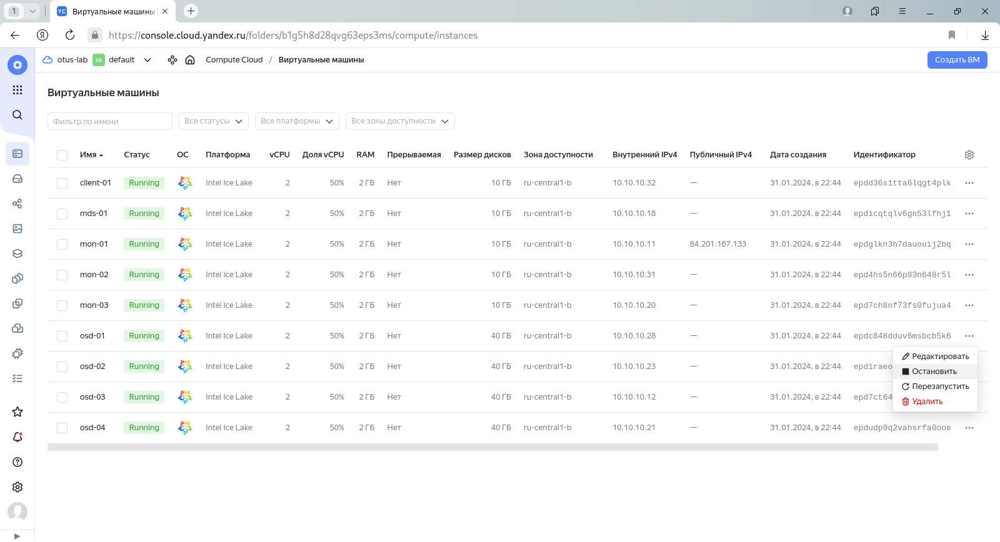

# lab-14
otus | ceph

### Домашнее задание
настройка CEPH

#### Цель:
Поднять отказоустойчивый кластер одним из способов, с фактором репликации 2 или выше, для использования rbd, cephfs, s3. 
Подключить клиентов к созданному хранилищу. Отработать сценарии сбоев.

#### Описание/Пошаговая инструкция выполнения домашнего задания:
C помощью terraform и ansible поднять отказоустойчивый кластер одним из способов, с фактором репликации 2 или выше, для использования rbd, cephfs

1. Cделать расчет кластера
2. Просчитать pg для pool'ов из расчета:
   rbd - 5/10 объема дисков
   cephfs - 3/10 объема дисков
   объяснить логику расчёта, создать пулы.
3. Создать и пробросить на клиентские машины:
   3 rbd
   cephfs (общий раздел на каждую машину)
4. Аварии и масштабирование:
   Сгенерировать split-brain, посмотреть поведение кластера, решить проблему (результат - запись консоли с выполнением)
   Сгенерировать сбой ноды с osd, вывести из кластера, добавить новую
   Сгенерировать сбой/обслуживание серверной/дата центра, проверить работоспособность сервисов (результат - запись консоли)
   Расширить кластер на 2+osd, сделать перерасчёт pg, объяснить логику
   Уменьшить кластер на 1+osd, сделать перерасчёт pg, объяснить логику

#### Формат сдачи
terraform манифесты
ansible роль (можно использовать https://github.com/ceph/ceph-ansible.git)
README.md

#### Критерии оценки:
Статус "Принято" ставится при выполнении перечисленных требований.

---

### Выполнение домашнего задания

Стенд будем разворачивать с помощью Terraform на YandexCloud, настройку серверов будем выполнять с помощью Kubernetes.

Необходимые файлы размещены в репозитории GitHub по ссылке:
```
https://github.com/SergSha/lab-14.git
```
Схема:


Для начала получаем OAUTH токен:
```
https://cloud.yandex.ru/docs/iam/concepts/authorization/oauth-token
```

Настраиваем аутентификации в консоли:
```bash
export YC_TOKEN=$(yc iam create-token)
export TF_VAR_yc_token=$YC_TOKEN
```

Скачиваем проект с гитхаба:
```bash
git clone https://github.com/SergSha/lab-14.git && cd ./lab-14
```

В файле input.auto.tfvars нужно вставить свой 'cloud_id':
```bash
cloud_id  = "..."
```

Ceph кластер будем разворачивать с помощью Terraform, а все установки и настройки необходимых приложений будем реализовывать с помощью Ansible.

Для того чтобы развернуть ceph кластер, нужно выполнить следующую команду:
```bash
terraform init && terraform apply -auto-approve && \
sleep 60 && ansible-playbook ./provision.yml
```

По завершению команды получим данные outputs:
```
Outputs:

client-info = {
  "client-01" = {
    "ip_address" = tolist([
      "10.10.10.32",
    ])
    "nat_ip_address" = tolist([
      "",
    ])
  }
}
mds-info = {
  "mds-01" = {
    "ip_address" = tolist([
      "10.10.10.18",
    ])
    "nat_ip_address" = tolist([
      "",
    ])
  }
}
mon-info = {
  "mon-01" = {
    "ip_address" = tolist([
      "10.10.10.11",
    ])
    "nat_ip_address" = tolist([
      "84.201.167.133",
    ])
  }
  "mon-02" = {
    "ip_address" = tolist([
      "10.10.10.31",
    ])
    "nat_ip_address" = tolist([
      "",
    ])
  }
  "mon-03" = {
    "ip_address" = tolist([
      "10.10.10.20",
    ])
    "nat_ip_address" = tolist([
      "",
    ])
  }
}
osd-info = {
  "osd-01" = {
    "ip_address" = tolist([
      "10.10.10.28",
    ])
    "nat_ip_address" = tolist([
      "",
    ])
  }
  "osd-02" = {
    "ip_address" = tolist([
      "10.10.10.23",
    ])
    "nat_ip_address" = tolist([
      "",
    ])
  }
  "osd-03" = {
    "ip_address" = tolist([
      "10.10.10.12",
    ])
    "nat_ip_address" = tolist([
      "",
    ])
  }
  "osd-04" = {
    "ip_address" = tolist([
      "10.10.10.21",
    ])
    "nat_ip_address" = tolist([
      "",
    ])
  }
}
```

На всех серверах будут установлены ОС Almalinux 9, настроены синхронизация времени Chrony, система принудительного контроля доступа SELinux, в качестве firewall будет использоваться NFTables.

Список виртуальных машин после запуска стенда:


Ceph кластер будет состоять из следующих серверов:
- мониторы (тут же и менеджеры): mon-01, mon-02, mon-03;
- сервер метаданных: mds-01;
- OSD: osd-01, osd-02, osd-03.

Также будут подготовлены:
- клиентский сервер client-01 для подключения к ceph кластеру;
- сервер osd-04 для замены одного из osd серверов.

Все osd сервера имеют по три дополнительных диска по 10 ГБ:
- vdb, vdc - которые будут включены в кластер во время разворачивания;
- vdd - для дополнительного включения в кластер при выполнении лабораторной работы.

Если в строке браузера введём следующую строку:
```
https://84.201.167.133:8443
```

то получим страницу Ceph Dashbooard:


В дальнейшем все команды будем выполнять на сервере mon-01, поэтому подключимся к этому серверу с помощью ssh, имея публичный адрес, полученный во время разворачивания инфраструктуры ceph кластера:
```bash
ssh almalinux@84.201.167.133
```
```
(.venv) [user@rocky9 lab-14]$ ssh almalinux@84.201.167.133
Last login: Wed Jan 31 22:57:42 2024 from 10.10.10.11
[almalinux@mon-01 ~]$ sudo -i
[root@mon-01 ~]# 
```

Просчитать pg для pool'ов:
rbd - 5/10 объема дисков 
cephfs - 3/10 объема дисков 
объяснить логику расчёта, создать пулы.

Формула для расчета: 
```
Total PGs = (Total_number_of_OSD * %_data * Target_PGs_per_OSD) / max_replication_count

Total_number_of_OSD - количество OSDs, в которых этот пул будет иметь PGS. Обычно это количество OSDs всего кластера, но может быть меньше в зависимости от правил CRUSH. (например, отдельные наборы дисков SSD и SATA)

%_data - это значение представляет приблизительный процент данных, которые будут содержаться в этом пуле для данного конкретного OSDs. 

Target PGs per OSD - это значение должно быть заполнено на основе следующего указания:
    100 - если количество OSDs кластера, как ожидается, не увеличится в обозримом будущем.
    200 - если ожидается, что количество OSDs кластера увеличится (до удвоения размера) в обозримом будущем.
    300 - если ожидается, что количество OSDs кластера увеличится в 2-3 раза в обозримом будущем.

max_replication_count - количество реплик, которые будут находиться в пуле. Значение, по умолчанию, равно 3.
```

Для 6 osd (с дисками по 10 Гб) получаем:

Для RBD: 
```
total PGs = (6 * 5/10 * 100) / 3 = 100 => 128 pg
```

Создаем пул myrbd: 
```bash
ceph osd pool create myrbd 128
ceph osd pool set myrbd size 3
ceph osd pool application enable myrbd rbd
```
```
[root@mon-01 ~]# ceph osd pool create myrbd 128
pool 'myrbd' created
[root@mon-01 ~]# ceph osd pool set myrbd size 3
set pool 2 size to 3
[root@mon-01 ~]# ceph osd pool application enable myrbd rbd
enabled application 'rbd' on pool 'myrbd'
[root@mon-01 ~]# 
```

Для cephfs: 
```
total PGs = (6 * 3/10 * 100) / 3 = 60 => 64 pg
```

Создаем пул для данных cephfs_data: 
```bash
ceph osd pool create cephfs_data 64
ceph osd pool set cephfs_data size 3
```
```
[root@mon-01 ~]# ceph osd pool create cephfs_data 64
pool 'cephfs_data' created
[root@mon-01 ~]# ceph osd pool set cephfs_data size 3
set pool 3 size to 3
[root@mon-01 ~]# 
```

и для метаданных cephfs_meta: 
```bash
ceph osd pool create cephfs_meta 64
ceph osd pool set cephfs_meta size 3
```
```
[root@mon-01 ~]# ceph osd pool create cephfs_meta 64
pool 'cephfs_meta' created
[root@mon-01 ~]# ceph osd pool set cephfs_meta size 3
set pool 4 size to 3
[root@mon-01 ~]# 
```

#### RBD
Создать и пробросить на клиентские машины 3 rbd 

Создадим 3 rbd диска:
```bash
rbd create disk1 --size 1G --pool myrbd
rbd create disk2 --size 2G --pool myrbd
rbd create disk3 --size 3G --pool myrbd
```
```
[root@mon-01 ~]# rbd create disk1 --size 1G --pool myrbd
[root@mon-01 ~]# rbd create disk2 --size 2G --pool myrbd
[root@mon-01 ~]# rbd create disk3 --size 3G --pool myrbd
[root@mon-01 ~]# rbd ls --pool myrbd
disk1
disk2
disk3
[root@mon-01 ~]# 
```

С клиентской машины client-01 осуществим подключение к ceph кластеру.

Скопируем ceph конфиг файл ceph.conf и ключ ceph.client.admin.keyring на клиентскую машину client-01:
```bash
scp /etc/ceph/{ceph.client.admin.keyring,ceph.conf} almalinux@client-01:/tmp/
```
```
[root@mon-01 ~]# scp /etc/ceph/{ceph.client.admin.keyring,ceph.conf} almalinux@client-01:/tmp/
ceph.client.admin.keyring                     100%  151   419.8KB/s   00:00    
ceph.conf                                     100%  265   894.2KB/s   00:00    
[root@mon-01 ~]# 
```

Подключимся к клиентской машине client-01 с помощью ssh и из директории /tmp перенесём ceph.conf и ключ ceph.client.admin.keyring в /etc/ceph/:
```
[root@mon-01 ~]# ssh almalinux@client-01
Last login: Wed Jan 31 22:53:29 2024 from 10.10.10.11
[almalinux@client-01 ~]$ sudo -i
[root@client-01 ~]# mv /tmp/{ceph.client.admin.keyring,ceph.conf} /etc/ceph/
[root@client-01 ~]# 
```
Ceph конфиг файл ceph.conf выглядит следующим образом:
```
[root@client-01 ~]# cat /etc/ceph/ceph.conf
# minimal ceph.conf for 6cd89b06-c072-11ee-95c4-d00d10ad2e38
[global]
	fsid = 6cd89b06-c072-11ee-95c4-d00d10ad2e38
	mon_host = [v2:10.10.10.11:3300/0,v1:10.10.10.11:6789/0] [v2:10.10.10.31:3300/0,v1:10.10.10.31:6789/0] [v2:10.10.10.20:3300/0,v1:10.10.10.20:6789/0]
```

Ключ клиента ceph.client.admin.keyring выглядит подобным образом:
```
[root@client-01 ~]# cat /etc/ceph/ceph.client.admin.keyring
[client.admin]
	key = AQDbpbplnLIMOBAAT7d4QijceBXi3ASEopVo2A==
	caps mds = "allow *"
	caps mgr = "allow *"
	caps mon = "allow *"
	caps osd = "allow *"
```

Подключим блочное устройство, например, disk3 к клиенту:
```bash
rbd device map myrbd/disk3
```
```
[root@client-01 ~]# rbd device map myrbd/disk3
/dev/rbd0
[root@client-01 ~]# rbd showmapped
id  pool   namespace  image  snap  device   
0   myrbd             disk3  -     /dev/rbd0
[root@client-01 ~]# 
```

Создадим файловую систему и смонтируем устройство:
```bash
mkfs.xfs /dev/rbd/myrbd/disk3
```
```
[root@client-01 ~]# mkfs.xfs /dev/rbd/myrbd/disk3
meta-data=/dev/rbd/myrbd/disk3   isize=512    agcount=8, agsize=98304 blks
         =                       sectsz=512   attr=2, projid32bit=1
         =                       crc=1        finobt=1, sparse=1, rmapbt=0
         =                       reflink=1    bigtime=1 inobtcount=1 nrext64=0
data     =                       bsize=4096   blocks=786432, imaxpct=25
         =                       sunit=16     swidth=16 blks
naming   =version 2              bsize=4096   ascii-ci=0, ftype=1
log      =internal log           bsize=4096   blocks=16384, version=2
         =                       sectsz=512   sunit=16 blks, lazy-count=1
realtime =none                   extsz=4096   blocks=0, rtextents=0
Discarding blocks...Done.
[root@client-01 ~]# 
```

Создадим директорий для монтирования:
```bash
mkdir /mnt/ceph_rbd
```
```
[root@client-01 ~]# mkdir /mnt/ceph_rbd
[root@client-01 ~]# 
```
Смонтируем файловую систему:
```bash
mount -t xfs /dev/rbd/myrbd/disk3 /mnt/ceph_rbd/
```
```
[root@client-01 ~]# mount -t xfs /dev/rbd/myrbd/disk3 /mnt/ceph_rbd/
[root@client-01 ~]# df -h | grep rbd
/dev/rbd0       3.0G   54M  2.9G   2% /mnt/ceph_rbd
[root@client-01 ~]# 
```

Автоматизируем данный процесс, но предварительно отмонтируем устройство:
```bash
umount /mnt/ceph_rbd/
rbd unmap /dev/rbd0
rbd showmapped
```
```
[root@client-01 ~]# umount /mnt/ceph_rbd/
[root@client-01 ~]# rbd unmap /dev/rbd0
[root@client-01 ~]# rbd showmapped
[root@client-01 ~]# 
```

Для автоматического подключения RBD устройств воспользуемся службой rbdmap, которая использует файл /etc/ceph/rbdmap и подключает все устройства, прописанные в данном файле.

Отредактируем файл /etc/ceph/rbdmap:
```bash
echo "myrbd/disk3             id=admin,keyring=/etc/ceph/ceph.client.admin.keyring" >> /etc/ceph/rbdmap
```
```
[root@client-01 ~]# echo "myrbd/disk3             id=admin,keyring=/etc/ceph/ceph.client.admin.keyring" >> /etc/ceph/rbdmap 
[root@client-01 ~]# cat /etc/ceph/rbdmap
# RbdDevice		      Parameters
#poolname/imagename	id=client,keyring=/etc/ceph/ceph.client.keyring
myrbd/disk3         id=admin,keyring=/etc/ceph/ceph.client.admin.keyring  #<--- добавлена строка
```

Добавим службу rbdmap в автозагрузку и сразу же запустим:
```bash
systemctl enable --now rbdmap
```
```
[root@client-01 ~]# systemctl enable --now rbdmap
Created symlink /etc/systemd/system/multi-user.target.wants/rbdmap.service → /usr/lib/systemd/system/rbdmap.service.
[root@client-01 ~]# rbd showmapped
id  pool   namespace  image  snap  device   
0   myrbd             disk3  -     /dev/rbd0
[root@client-01 ~]# 
```

Подправим fstab, для автоматического монтирования после перезагрузки ОС:
```bash
echo "/dev/rbd/myrbd/disk3                      /mnt/ceph_rbd           xfs     _netdev         0 0" >> /etc/fstab
```
```
[root@client-01 ~]# echo "/dev/rbd/myrbd/disk3                      /mnt/ceph_rbd           xfs     _netdev         0 0" >> /etc/fstab
[root@client-01 ~]# cat /etc/fstab

#
# /etc/fstab
# Created by anaconda on Wed Nov  9 10:15:27 2022
#
# Accessible filesystems, by reference, are maintained under '/dev/disk/'.
# See man pages fstab(5), findfs(8), mount(8) and/or blkid(8) for more info.
#
# After editing this file, run 'systemctl daemon-reload' to update systemd
# units generated from this file.
#
UUID=ceb11787-f80b-4377-859f-a83f14385537 /                       xfs     defaults        0 0
/dev/rbd/myrbd/disk3                      /mnt/ceph_rbd           xfs     _netdev         0 0  #<--- добавлена строка
```

#### Cephfs
Создать и пробросить на клиентские машины cephfs (общий раздел на каждую машину)

Создадим файловую систему cephfs, для этого на сервере mon-01 выполним следующую команду:
```bash
ceph fs new cephfs cephfs_meta cephfs_data
```
```
[root@mon-01 ~]# ceph fs new cephfs cephfs_meta cephfs_data
  Pool 'cephfs_data' (id '3') has pg autoscale mode 'on' but is not marked as bulk.
  Consider setting the flag by running
    # ceph osd pool set cephfs_data bulk true
new fs with metadata pool 4 and data pool 3
[root@mon-01 ~]# 
```
```
[root@mon-01 ~]# ceph fs ls
name: cephfs, metadata pool: cephfs_meta, data pools: [cephfs_data ]
[root@mon-01 ~]# 
```

На клиентской машине client-01 cоздадим директорий для монтирования файловой системы cephfs:
```bash
mkdir /mnt/cephfs
```
```
[root@client-01 ~]# mkdir /mnt/cephfs
[root@client-01 ~]# 
```

Получим fsid ceph кластера:
```bash
ceph fsid
```
```
[root@client-01 ~]# ceph fsid
2c745bde-bf98-11ee-9416-d00d3f30ed62
[root@client-01 ~]# 
```

Смонтируем файловую систему cephfs:
```bash
mount.ceph admin@$(ceph fsid).cephfs=/ /mnt/cephfs/
```
```
[root@client-01 ~]# mount.ceph admin@$(ceph fsid).cephfs=/ /mnt/cephfs/
[root@client-01 ~]# df -h | grep cephfs
admin@6cd89b06-c072-11ee-95c4-d00d10ad2e38.cephfs=/   19G     0   19G   0% /mnt/cephfs
[root@client-01 ~]# 
```

Для наглядности на каждом из монтированных файловых систем ceph создадим по текстовому файлу:
```bash
echo "Hello RBD" > /mnt/ceph_rbd/rbd.txt
echo "Hello CephFS" > /mnt/cephfs/cephfs.txt
```
```
[root@client-01 ~]# echo "Hello RBD" > /mnt/ceph_rbd/rbd.txt
[root@client-01 ~]# cat /mnt/ceph_rbd/rbd.txt 
Hello RBD
[root@client-01 ~]# echo "Hello CephFS" > /mnt/cephfs/cephfs.txt
[root@client-01 ~]# cat /mnt/cephfs/cephfs.txt 
Hello CephFS
[root@client-01 ~]# 
```

#### Сгенерировать сбой ноды с osd, вывести из кластера, добавить новую

Сначала посмотрим состояние ceph кластера:
```bash
ceph -s
```
```
[root@mon-01 ~]# ceph -s
  cluster:
    id:     6cd89b06-c072-11ee-95c4-d00d10ad2e38
    health: HEALTH_OK
 
  services:
    mon: 3 daemons, quorum mon-01,mon-03,mon-02 (age 31m)
    mgr: mon-01.ftrluw(active, since 35m), standbys: mon-03.yfcobu, mon-02.fptjwt
    mds: 1/1 daemons up
    osd: 6 osds: 6 up (since 30m), 6 in (since 31m)
 
  data:
    volumes: 1/1 healthy
    pools:   4 pools, 113 pgs
    objects: 45 objects, 6.8 MiB
    usage:   473 MiB used, 60 GiB / 60 GiB avail
    pgs:     113 active+clean
 
[root@mon-01 ~]# 
```

```bash
ceph health detail
```
```
[root@mon-01 ~]# ceph health detail
HEALTH_OK
[root@mon-01 ~]# 
```

Список хостов ceph кластера:
```bash
ceph orch host ls
```
```
[root@mon-01 ~]# ceph orch host ls
HOST                ADDR         LABELS  STATUS  
mds-01.example.com  10.10.10.18                  
mon-01.example.com  10.10.10.11  _admin          
mon-02.example.com  10.10.10.31                  
mon-03.example.com  10.10.10.20                  
osd-01.example.com  10.10.10.28                  
osd-02.example.com  10.10.10.23                  
osd-03.example.com  10.10.10.12                  
7 hosts in cluster
[root@mon-01 ~]# 
```

Список osd:
```bash
ceph osd tree
```
```
[root@mon-01 ~]# ceph osd tree
ID  CLASS  WEIGHT   TYPE NAME        STATUS  REWEIGHT  PRI-AFF
-1         0.05878  root default                              
-5         0.01959      host osd-01                           
 1    hdd  0.00980          osd.1        up   1.00000  1.00000
 4    hdd  0.00980          osd.4        up   1.00000  1.00000
-3         0.01959      host osd-02                           
 0    hdd  0.00980          osd.0        up   1.00000  1.00000
 3    hdd  0.00980          osd.3        up   1.00000  1.00000
-7         0.01959      host osd-03                           
 2    hdd  0.00980          osd.2        up   1.00000  1.00000
 5    hdd  0.00980          osd.5        up   1.00000  1.00000
[root@mon-01 ~]# 
```

Для отслеживания изменения состояния ceph кластера в другом терминале запустим команду:
```bash
ceph -w
```
```
[root@mon-01 ~]# ceph -w
  cluster:
    id:     6cd89b06-c072-11ee-95c4-d00d10ad2e38
    health: HEALTH_OK
 
  services:
    mon: 3 daemons, quorum mon-01,mon-03,mon-02 (age 39m)
    mgr: mon-01.ftrluw(active, since 42m), standbys: mon-03.yfcobu, mon-02.fptjwt
    mds: 1/1 daemons up
    osd: 6 osds: 6 up (since 38m), 6 in (since 38m)
 
  data:
    volumes: 1/1 healthy
    pools:   4 pools, 113 pgs
    objects: 45 objects, 6.8 MiB
    usage:   473 MiB used, 60 GiB / 60 GiB avail
    pgs:     113 active+clean
 


```

Отключим один из серверов osd, например, osd-01, таким образом имитируем аварийное отключение:




Ceph Dashboard выглядит следующим образом:


В текущем окне терминала проверим промежуточное состояние ceph кластера:
```
[root@mon-01 ~]# ceph health
HEALTH_WARN 2 osds down; 1 host (2 osds) down; Degraded data redundancy: 45/135 objects degraded (33.333%), 30 pgs degraded, 113 pgs undersized
[root@mon-01 ~]# 
```

```
[root@mon-01 ~]# ceph -s
  cluster:
    id:     6cd89b06-c072-11ee-95c4-d00d10ad2e38
    health: HEALTH_WARN
            2 osds down
            1 host (2 osds) down
            Degraded data redundancy: 45/135 objects degraded (33.333%), 30 pgs degraded, 113 pgs undersized
 
  services:
    mon: 3 daemons, quorum mon-01,mon-03,mon-02 (age 43m)
    mgr: mon-01.ftrluw(active, since 46m), standbys: mon-03.yfcobu, mon-02.fptjwt
    mds: 1/1 daemons up
    osd: 6 osds: 4 up (since 3m), 6 in (since 42m)
 
  data:
    volumes: 1/1 healthy
    pools:   4 pools, 113 pgs
    objects: 45 objects, 6.8 MiB
    usage:   473 MiB used, 60 GiB / 60 GiB avail
    pgs:     45/135 objects degraded (33.333%)
             83 active+undersized
             30 active+undersized+degraded
 
[root@mon-01 ~]# 
```

Сначала проверим, какой OSD не работает, и удалим его из кластера Ceph, используя команду:
```bash
ceph osd tree
```
```
[root@mon-01 ~]# ceph osd tree
ID  CLASS  WEIGHT   TYPE NAME        STATUS  REWEIGHT  PRI-AFF
-1         0.05878  root default                              
-5         0.01959      host osd-01                           
 1    hdd  0.00980          osd.1      down   1.00000  1.00000
 4    hdd  0.00980          osd.4      down   1.00000  1.00000
-3         0.01959      host osd-02                           
 0    hdd  0.00980          osd.0        up   1.00000  1.00000
 3    hdd  0.00980          osd.3        up   1.00000  1.00000
-7         0.01959      host osd-03                           
 2    hdd  0.00980          osd.2        up   1.00000  1.00000
 5    hdd  0.00980          osd.5        up   1.00000  1.00000
[root@mon-01 ~]# 
```

Теперь используем следующие команды:
```bash
ceph osd out osd.1
ceph osd out osd.4
```
```
[root@mon-01 ~]# ceph osd out osd.1
marked out osd.1. 
[root@mon-01 ~]# ceph osd out osd.4
marked out osd.4. 
[root@mon-01 ~]# 
```

```bash
ceph osd down osd.1
ceph osd down osd.4
```
```
[root@mon-01 ~]# ceph osd down osd.1
osd.1 is already down. 
[root@mon-01 ~]# ceph osd down osd.4
osd.4 is already down. 
[root@mon-01 ~]# 
```

Удалим их:
```bash
ceph osd rm osd.1
ceph osd rm osd.4
```
```
[root@mon-01 ~]# ceph osd rm osd.1
removed osd.1
[root@mon-01 ~]# ceph osd rm osd.4
removed osd.4
[root@mon-01 ~]# 
```

Удалим их из crush map:
```bash
ceph osd crush rm osd.1
ceph osd crush rm osd.4
```
```
[root@mon-01 ~]# ceph osd crush rm osd.1
removed item id 1 name 'osd.1' from crush map
[root@mon-01 ~]# ceph osd crush rm osd.4
removed item id 4 name 'osd.4' from crush map
[root@mon-01 ~]# 
```

Удалим авторизацию (это должно предотвратить проблемы с «couldn’t add new osd with same number»):
```bash
ceph auth del osd.1
ceph auth del osd.4
```
```
[root@mon-01 ~]# ceph auth del osd.1
[root@mon-01 ~]# ceph auth del osd.4
[root@mon-01 ~]# 
```

Удаляем osd:
```bash
ceph osd destroy 1 --yes-i-really-mean-it
ceph osd destroy 4 --yes-i-really-mean-it
```
```
[root@mon-01 ~]# ceph osd destroy 1 --yes-i-really-mean-it
osd.1 does not exist
[root@mon-01 ~]# ceph osd destroy 4 --yes-i-really-mean-it
osd.4 does not exist
[root@mon-01 ~]# 
```

Проверим состояние кластера Ceph:
```bash
ceph -s
```
```
[root@mon-01 ~]# ceph -s
  cluster:
    id:     6cd89b06-c072-11ee-95c4-d00d10ad2e38
    health: HEALTH_WARN
            Degraded data redundancy: 23/135 objects degraded (17.037%), 13 pgs degraded, 38 pgs undersized
 
  services:
    mon: 3 daemons, quorum mon-01,mon-03,mon-02 (age 50m)
    mgr: mon-01.ftrluw(active, since 53m), standbys: mon-03.yfcobu, mon-02.fptjwt
    mds: 1/1 daemons up
    osd: 4 osds: 4 up (since 5m), 4 in (since 119s); 71 remapped pgs
 
  data:
    volumes: 1/1 healthy
    pools:   4 pools, 113 pgs
    objects: 45 objects, 6.8 MiB
    usage:   317 MiB used, 40 GiB / 40 GiB avail
    pgs:     23/135 objects degraded (17.037%)
             22/135 objects misplaced (16.296%)
             69 active+clean+remapped
             29 active+undersized
             13 active+undersized+degraded
             2  active+clean
 
[root@mon-01 ~]# 
```
Добавим в ceph кластер новый подготовленный osd хост osd-04:
```bash
ceph orch host add osd-04.example.com
```
```
[root@mon-01 ~]# ceph orch host add osd-04.example.com
Added host 'osd-04.example.com' with addr '10.10.10.21'
[root@mon-01 ~]# 
```

Подключим диски vdb и vdc нового хоста osd-04:
```bash
ceph orch daemon add osd osd-04.example.com:/dev/vdb,/dev/vdc
```
```
[root@mon-01 ~]# ceph orch daemon add osd osd-04.example.com:/dev/vdb,/dev/vdc
Created osd(s) 1,4 on host 'osd-04.example.com'
[root@mon-01 ~]# 
```

Список osd кластера:
```bash
ceph osd tree
```
```
[root@mon-01 ~]# ceph osd tree
ID  CLASS  WEIGHT   TYPE NAME        STATUS  REWEIGHT  PRI-AFF
-1         0.05878  root default                              
-5               0      host osd-01                           
-3         0.01959      host osd-02                           
 0    hdd  0.00980          osd.0        up   1.00000  1.00000
 3    hdd  0.00980          osd.3        up   1.00000  1.00000
-7         0.01959      host osd-03                           
 2    hdd  0.00980          osd.2        up   1.00000  1.00000
 5    hdd  0.00980          osd.5        up   1.00000  1.00000
-9         0.01959      host osd-04                           
 1    hdd  0.00980          osd.1        up   1.00000  1.00000
 4    hdd  0.00980          osd.4        up   1.00000  1.00000
[root@mon-01 ~]# 
```

Список хостов кластера:
```bash
ceph orch host ls
```
```
[root@mon-01 ~]# ceph orch host ls
HOST                ADDR         LABELS  STATUS   
mds-01.example.com  10.10.10.18                   
mon-01.example.com  10.10.10.11  _admin           
mon-02.example.com  10.10.10.31                   
mon-03.example.com  10.10.10.20                   
osd-01.example.com  10.10.10.28          Offline  
osd-02.example.com  10.10.10.23                   
osd-03.example.com  10.10.10.12                   
osd-04.example.com  10.10.10.21                   
8 hosts in cluster
[root@mon-01 ~]# 
```

Как видим, в ceph кластер добавился хост osd-04 с дисками vdb и vdc. 

Хост osd-01 находится в состоянии Offline.

Отключим демоны, работающие с хостом osd-01:
```bash
ceph orch host drain osd-01.example.com
```
```
[root@mon-01 ~]# ceph orch host drain osd-01.example.com
Scheduled to remove the following daemons from host 'osd-01.example.com'
type                 id             
-------------------- ---------------
ceph-exporter        osd-01         
crash                osd-01         
node-exporter        osd-01         
osd                  1              
osd                  4              
[root@mon-01 ~]# 
```

Так как хост osd-01 недоступен, удалим его из кластера:
```bash
ceph orch host rm osd-01.example.com --offline --force
```
```
[root@mon-01 ~]# ceph orch host rm osd-01.example.com --offline --force
Removed offline host 'osd-01.example.com'
[root@mon-01 ~]# 
```

Список хостов ceph кластера:
```bash
ceph orch host ls
```
```
[root@mon-01 ~]# ceph orch host ls
HOST                ADDR         LABELS  STATUS  
mds-01.example.com  10.10.10.18                  
mon-01.example.com  10.10.10.11  _admin          
mon-02.example.com  10.10.10.31                  
mon-03.example.com  10.10.10.20                  
osd-02.example.com  10.10.10.23                  
osd-03.example.com  10.10.10.12                  
osd-04.example.com  10.10.10.21                  
7 hosts in cluster
[root@mon-01 ~]# 
```

Как видим, хоста osd-01 отсутствует в списке хостов кластера.

Список osd в ceph кластере:
```bash
ceph osd tree
```
```
[root@mon-01 ~]# ceph osd tree
ID  CLASS  WEIGHT   TYPE NAME        STATUS  REWEIGHT  PRI-AFF
-1         0.05878  root default                              
-5               0      host osd-01                           
-3         0.01959      host osd-02                           
 0    hdd  0.00980          osd.0        up   1.00000  1.00000
 3    hdd  0.00980          osd.3        up   1.00000  1.00000
-7         0.01959      host osd-03                           
 2    hdd  0.00980          osd.2        up   1.00000  1.00000
 5    hdd  0.00980          osd.5        up   1.00000  1.00000
-9         0.01959      host osd-04                           
 1    hdd  0.00980          osd.1        up   1.00000  1.00000
 4    hdd  0.00980          osd.4        up   1.00000  1.00000
[root@mon-01 ~]# 
```

Состояние ceph кластера:
```bash
ceph health detail
```
```
[root@mon-01 ~]# ceph health detail
HEALTH_OK
[root@mon-01 ~]# 
```

```bash
ceph -s
```
```
[root@mon-01 ~]# ceph -s
  cluster:
    id:     6cd89b06-c072-11ee-95c4-d00d10ad2e38
    health: HEALTH_OK
 
  services:
    mon: 3 daemons, quorum mon-01,mon-03,mon-02 (age 64m)
    mgr: mon-01.ftrluw(active, since 67m), standbys: mon-03.yfcobu, mon-02.fptjwt
    mds: 1/1 daemons up
    osd: 6 osds: 6 up (since 9m), 6 in (since 10m); 113 remapped pgs
 
  data:
    volumes: 1/1 healthy
    pools:   4 pools, 113 pgs
    objects: 45 objects, 6.8 MiB
    usage:   465 MiB used, 60 GiB / 60 GiB avail
    pgs:     45/135 objects misplaced (33.333%)
             113 active+clean+remapped
 
[root@mon-01 ~]# 
```

Ceph Dashboard выглядит теперь таким образом:


Проверим наличие созданных файлов:
```bash
cat /mnt/ceph_rbd/rbd.txt
cat /mnt/cephfs/cephfs.txt
```
```
[root@client-01 ~]# cat /mnt/ceph_rbd/rbd.txt 
Hello RBD
[root@client-01 ~]# cat /mnt/cephfs/cephfs.txt 
Hello CephFS
[root@client-01 ~]# 
```

Вывод результата команды ceph -w, что было запущено в другом терминале перед отключением ноды osd-01:
```
[root@mon-01 ~]# ceph -w
  cluster:
    id:     6cd89b06-c072-11ee-95c4-d00d10ad2e38
    health: HEALTH_OK
 
  services:
    mon: 3 daemons, quorum mon-01,mon-03,mon-02 (age 39m)
    mgr: mon-01.ftrluw(active, since 42m), standbys: mon-03.yfcobu, mon-02.fptjwt
    mds: 1/1 daemons up
    osd: 6 osds: 6 up (since 38m), 6 in (since 38m)
 
  data:
    volumes: 1/1 healthy
    pools:   4 pools, 113 pgs
    objects: 45 objects, 6.8 MiB
    usage:   473 MiB used, 60 GiB / 60 GiB avail
    pgs:     113 active+clean
 

2024-01-31T23:43:53.721149+0300 mon.mon-01 [INF] osd.1 marked itself down and dead
2024-01-31T23:43:53.976994+0300 mon.mon-01 [INF] osd.4 marked itself down and dead
2024-01-31T23:43:54.326269+0300 mon.mon-01 [WRN] Health check failed: 2 osds down (OSD_DOWN)
2024-01-31T23:43:54.326306+0300 mon.mon-01 [WRN] Health check failed: 1 host (2 osds) down (OSD_HOST_DOWN)
2024-01-31T23:43:56.462401+0300 mon.mon-01 [WRN] Health check failed: Reduced data availability: 16 pgs inactive, 46 pgs peering (PG_AVAILABILITY)
2024-01-31T23:43:58.504121+0300 mon.mon-01 [WRN] Health check failed: Degraded data redundancy: 19/135 objects degraded (14.074%), 14 pgs degraded (PG_DEGRADED)
2024-01-31T23:44:00.677395+0300 mon.mon-01 [INF] Health check cleared: PG_AVAILABILITY (was: Reduced data availability: 16 pgs inactive, 46 pgs peering)
2024-01-31T23:44:03.737901+0300 mon.mon-01 [WRN] Health check update: Degraded data redundancy: 45/135 objects degraded (33.333%), 30 pgs degraded (PG_DEGRADED)
2024-01-31T23:44:10.333962+0300 mon.mon-01 [WRN] Health check failed: failed to probe daemons or devices (CEPHADM_REFRESH_FAILED)
2024-01-31T23:44:57.049604+0300 mon.mon-01 [WRN] Health check update: Degraded data redundancy: 45/135 objects degraded (33.333%), 30 pgs degraded, 113 pgs undersized (PG_DEGRADED)
2024-01-31T23:45:12.476401+0300 mon.mon-01 [INF] Health check cleared: CEPHADM_REFRESH_FAILED (was: failed to probe daemons or devices)
2024-01-31T23:48:24.126829+0300 mon.mon-01 [INF] Client client.admin marked osd.2 out, while it was still marked up
2024-01-31T23:48:25.041892+0300 mon.mon-01 [INF] Client client.admin marked osd.4 out, after it was down for 270 seconds
2024-01-31T23:48:25.698327+0300 mon.mon-01 [WRN] Health check update: 1 osds down (OSD_DOWN)
2024-01-31T23:48:27.891929+0300 mon.mon-01 [WRN] Health check failed: Reduced data availability: 5 pgs inactive, 10 pgs peering (PG_AVAILABILITY)
2024-01-31T23:48:27.891951+0300 mon.mon-01 [WRN] Health check update: Degraded data redundancy: 37/135 objects degraded (27.407%), 22 pgs degraded, 84 pgs undersized (PG_DEGRADED)
2024-01-31T23:48:32.530376+0300 mon.mon-01 [INF] Health check cleared: PG_AVAILABILITY (was: Reduced data availability: 5 pgs inactive, 10 pgs peering)
2024-01-31T23:48:34.350775+0300 mon.mon-01 [WRN] Health check update: Degraded data redundancy: 26/135 objects degraded (19.259%), 16 pgs degraded, 59 pgs undersized (PG_DEGRADED)
2024-01-31T23:48:39.375323+0300 mon.mon-01 [WRN] Health check update: Degraded data redundancy: 30/135 objects degraded (22.222%), 20 pgs degraded, 59 pgs undersized (PG_DEGRADED)
2024-01-31T23:48:39.945663+0300 osd.2 [WRN] Monitor daemon marked osd.2 down, but it is still running
2024-01-31T23:48:40.062412+0300 mon.mon-01 [INF] osd.2 marked itself dead as of e701
2024-01-31T23:48:41.151494+0300 mon.mon-01 [INF] osd.2 [v2:10.10.10.12:6800/3231514103,v1:10.10.10.12:6801/3231514103] boot
2024-01-31T23:48:44.386721+0300 mon.mon-01 [WRN] Health check update: Degraded data redundancy: 41/135 objects degraded (30.370%), 26 pgs degraded, 59 pgs undersized (PG_DEGRADED)
2024-01-31T23:48:48.419301+0300 mon.mon-01 [WRN] Health check failed: 1 osds exist in the crush map but not in the osdmap (OSD_ORPHAN)
2024-01-31T23:48:49.389800+0300 mon.mon-01 [WRN] Health check update: Degraded data redundancy: 26/135 objects degraded (19.259%), 16 pgs degraded, 59 pgs undersized (PG_DEGRADED)
2024-01-31T23:50:00.000227+0300 mon.mon-01 [WRN] Health detail: HEALTH_WARN 1 osds down; 1 host (2 osds) down; 1 osds exist in the crush map but not in the osdmap; Degraded data redundancy: 26/135 objects degraded (19.259%), 16 pgs degraded, 59 pgs undersized
2024-01-31T23:50:00.000266+0300 mon.mon-01 [WRN] [WRN] OSD_DOWN: 1 osds down
2024-01-31T23:50:00.000272+0300 mon.mon-01 [WRN]     osd.1 (root=default,host=osd-01) is down
2024-01-31T23:50:00.000277+0300 mon.mon-01 [WRN] [WRN] OSD_HOST_DOWN: 1 host (2 osds) down
2024-01-31T23:50:00.000283+0300 mon.mon-01 [WRN]     host osd-01 (root=default) (2 osds) is down
2024-01-31T23:50:00.000290+0300 mon.mon-01 [WRN] [WRN] OSD_ORPHAN: 1 osds exist in the crush map but not in the osdmap
2024-01-31T23:50:00.000298+0300 mon.mon-01 [WRN]     osd.4 exists in crush map but not in osdmap
2024-01-31T23:50:00.000304+0300 mon.mon-01 [WRN] [WRN] PG_DEGRADED: Degraded data redundancy: 26/135 objects degraded (19.259%), 16 pgs degraded, 59 pgs undersized
2024-01-31T23:50:00.000320+0300 mon.mon-01 [WRN]     pg 1.0 is stuck undersized for 6m, current state active+undersized+degraded, last acting [5,3]
2024-01-31T23:50:00.000326+0300 mon.mon-01 [WRN]     pg 2.0 is stuck undersized for 6m, current state active+undersized+degraded, last acting [5,3]
2024-01-31T23:50:00.000333+0300 mon.mon-01 [WRN]     pg 2.1 is stuck undersized for 6m, current state active+undersized+degraded, last acting [3,5]
2024-01-31T23:50:00.000338+0300 mon.mon-01 [WRN]     pg 2.3 is stuck undersized for 6m, current state active+undersized, last acting [3,5]
2024-01-31T23:50:00.000344+0300 mon.mon-01 [WRN]     pg 2.9 is stuck undersized for 6m, current state active+undersized, last acting [3,5]
2024-01-31T23:50:00.000352+0300 mon.mon-01 [WRN]     pg 2.b is stuck undersized for 6m, current state active+undersized, last acting [5,0]
2024-01-31T23:50:00.000358+0300 mon.mon-01 [WRN]     pg 2.d is stuck undersized for 6m, current state active+undersized, last acting [5,3]
2024-01-31T23:50:00.000364+0300 mon.mon-01 [WRN]     pg 2.12 is stuck undersized for 6m, current state active+undersized+degraded, last acting [5,3]
2024-01-31T23:50:00.000383+0300 mon.mon-01 [WRN]     pg 2.15 is stuck undersized for 6m, current state active+undersized+degraded, last acting [5,0]
2024-01-31T23:50:00.000392+0300 mon.mon-01 [WRN]     pg 2.17 is stuck undersized for 6m, current state active+undersized+degraded, last acting [5,3]
2024-01-31T23:50:00.000397+0300 mon.mon-01 [WRN]     pg 2.18 is active+undersized+degraded, acting [5,3]
2024-01-31T23:50:00.000403+0300 mon.mon-01 [WRN]     pg 3.0 is stuck undersized for 6m, current state active+undersized, last acting [5,0]
2024-01-31T23:50:00.000409+0300 mon.mon-01 [WRN]     pg 3.2 is stuck undersized for 6m, current state active+undersized, last acting [3,5]
2024-01-31T23:50:00.000415+0300 mon.mon-01 [WRN]     pg 3.3 is stuck undersized for 6m, current state active+undersized, last acting [0,5]
2024-01-31T23:50:00.000420+0300 mon.mon-01 [WRN]     pg 3.5 is stuck undersized for 6m, current state active+undersized, last acting [3,5]
2024-01-31T23:50:00.000425+0300 mon.mon-01 [WRN]     pg 3.6 is stuck undersized for 6m, current state active+undersized, last acting [0,5]
2024-01-31T23:50:00.000432+0300 mon.mon-01 [WRN]     pg 3.7 is stuck undersized for 6m, current state active+undersized, last acting [3,5]
2024-01-31T23:50:00.000438+0300 mon.mon-01 [WRN]     pg 3.9 is stuck undersized for 6m, current state active+undersized, last acting [5,3]
2024-01-31T23:50:00.000443+0300 mon.mon-01 [WRN]     pg 3.a is stuck undersized for 6m, current state active+undersized, last acting [3,5]
2024-01-31T23:50:00.000448+0300 mon.mon-01 [WRN]     pg 3.b is stuck undersized for 6m, current state active+undersized, last acting [3,5]
2024-01-31T23:50:00.000454+0300 mon.mon-01 [WRN]     pg 3.c is stuck undersized for 6m, current state active+undersized, last acting [3,5]
2024-01-31T23:50:00.000459+0300 mon.mon-01 [WRN]     pg 3.f is stuck undersized for 6m, current state active+undersized, last acting [5,0]
2024-01-31T23:50:00.000465+0300 mon.mon-01 [WRN]     pg 3.10 is stuck undersized for 6m, current state active+undersized, last acting [5,3]
2024-01-31T23:50:00.000470+0300 mon.mon-01 [WRN]     pg 3.11 is stuck undersized for 6m, current state active+undersized, last acting [5,0]
2024-01-31T23:50:00.000476+0300 mon.mon-01 [WRN]     pg 3.12 is stuck undersized for 6m, current state active+undersized, last acting [0,5]
2024-01-31T23:50:00.000481+0300 mon.mon-01 [WRN]     pg 3.16 is stuck undersized for 6m, current state active+undersized, last acting [3,5]
2024-01-31T23:50:00.000486+0300 mon.mon-01 [WRN]     pg 3.17 is stuck undersized for 6m, current state active+undersized, last acting [0,5]
2024-01-31T23:50:00.000491+0300 mon.mon-01 [WRN]     pg 3.25 is stuck undersized for 6m, current state active+undersized, last acting [5,3]
2024-01-31T23:50:00.000497+0300 mon.mon-01 [WRN]     pg 3.28 is stuck undersized for 6m, current state active+undersized, last acting [5,3]
2024-01-31T23:50:00.000502+0300 mon.mon-01 [WRN]     pg 3.2a is stuck undersized for 6m, current state active+undersized, last acting [3,5]
2024-01-31T23:50:00.000508+0300 mon.mon-01 [WRN]     pg 3.2b is stuck undersized for 6m, current state active+undersized, last acting [0,5]
2024-01-31T23:50:00.000513+0300 mon.mon-01 [WRN]     pg 3.2c is stuck undersized for 6m, current state active+undersized, last acting [5,3]
2024-01-31T23:50:00.000519+0300 mon.mon-01 [WRN]     pg 3.2f is stuck undersized for 6m, current state active+undersized, last acting [5,0]
2024-01-31T23:50:00.000525+0300 mon.mon-01 [WRN]     pg 3.32 is stuck undersized for 6m, current state active+undersized, last acting [0,5]
2024-01-31T23:50:00.000530+0300 mon.mon-01 [WRN]     pg 3.33 is stuck undersized for 6m, current state active+undersized, last acting [3,5]
2024-01-31T23:50:00.000536+0300 mon.mon-01 [WRN]     pg 3.34 is stuck undersized for 6m, current state active+undersized, last acting [5,0]
2024-01-31T23:50:00.000542+0300 mon.mon-01 [WRN]     pg 3.35 is stuck undersized for 6m, current state active+undersized, last acting [5,0]
2024-01-31T23:50:00.000550+0300 mon.mon-01 [WRN]     pg 3.37 is stuck undersized for 6m, current state active+undersized, last acting [5,0]
2024-01-31T23:50:00.000555+0300 mon.mon-01 [WRN]     pg 3.38 is stuck undersized for 6m, current state active+undersized, last acting [3,5]
2024-01-31T23:50:00.000562+0300 mon.mon-01 [WRN]     pg 3.39 is stuck undersized for 6m, current state active+undersized, last acting [0,5]
2024-01-31T23:50:00.000568+0300 mon.mon-01 [WRN]     pg 3.3a is stuck undersized for 6m, current state active+undersized, last acting [0,5]
2024-01-31T23:50:00.000573+0300 mon.mon-01 [WRN]     pg 3.3e is stuck undersized for 6m, current state active+undersized, last acting [0,5]
2024-01-31T23:50:00.000580+0300 mon.mon-01 [WRN]     pg 4.0 is stuck undersized for 6m, current state active+undersized+degraded, last acting [3,5]
2024-01-31T23:50:00.000585+0300 mon.mon-01 [WRN]     pg 4.4 is stuck undersized for 6m, current state active+undersized+degraded, last acting [0,5]
2024-01-31T23:50:00.000591+0300 mon.mon-01 [WRN]     pg 4.5 is stuck undersized for 6m, current state active+undersized+degraded, last acting [5,0]
2024-01-31T23:50:00.000597+0300 mon.mon-01 [WRN]     pg 4.6 is stuck undersized for 6m, current state active+undersized+degraded, last acting [5,3]
2024-01-31T23:50:00.000602+0300 mon.mon-01 [WRN]     pg 4.7 is stuck undersized for 6m, current state active+undersized+degraded, last acting [0,5]
2024-01-31T23:50:00.000607+0300 mon.mon-01 [WRN]     pg 4.8 is stuck undersized for 6m, current state active+undersized, last acting [5,3]
2024-01-31T23:50:00.000613+0300 mon.mon-01 [WRN]     pg 4.9 is stuck undersized for 6m, current state active+undersized, last acting [5,0]
2024-01-31T23:50:00.000619+0300 mon.mon-01 [WRN]     pg 4.b is stuck undersized for 6m, current state active+undersized+degraded, last acting [0,5]
2024-01-31T23:50:00.000625+0300 mon.mon-01 [WRN]     pg 4.e is stuck undersized for 6m, current state active+undersized+degraded, last acting [5,0]
2024-01-31T23:52:08.229695+0300 mon.mon-01 [INF] Client client.admin marked osd.1 out, after it was down for 493 seconds
2024-01-31T23:52:08.365243+0300 mon.mon-01 [INF] Health check cleared: OSD_DOWN (was: 1 osds down)
2024-01-31T23:52:08.365269+0300 mon.mon-01 [INF] Health check cleared: OSD_HOST_DOWN (was: 1 host (2 osds) down)
2024-01-31T23:52:29.547949+0300 mon.mon-01 [WRN] Health check update: 2 osds exist in the crush map but not in the osdmap (OSD_ORPHAN)
2024-01-31T23:52:42.318256+0300 mon.mon-01 [WRN] Health check update: 1 osds exist in the crush map but not in the osdmap (OSD_ORPHAN)
2024-01-31T23:52:44.415564+0300 mon.mon-01 [WRN] Health check update: Degraded data redundancy: 26/135 objects degraded (19.259%), 16 pgs degraded, 57 pgs undersized (PG_DEGRADED)
2024-01-31T23:52:49.952124+0300 mon.mon-01 [WRN] Health check update: Degraded data redundancy: 26/135 objects degraded (19.259%), 16 pgs degraded, 49 pgs undersized (PG_DEGRADED)
2024-01-31T23:52:54.956596+0300 mon.mon-01 [WRN] Health check update: Degraded data redundancy: 25/135 objects degraded (18.519%), 15 pgs degraded, 48 pgs undersized (PG_DEGRADED)
2024-01-31T23:53:16.315275+0300 mon.mon-01 [INF] Health check cleared: OSD_ORPHAN (was: 1 osds exist in the crush map but not in the osdmap)
2024-01-31T23:53:18.404733+0300 mon.mon-01 [WRN] Health check failed: Reduced data availability: 1 pg peering (PG_AVAILABILITY)
2024-01-31T23:53:18.404754+0300 mon.mon-01 [WRN] Health check update: Degraded data redundancy: 24/135 objects degraded (17.778%), 14 pgs degraded, 46 pgs undersized (PG_DEGRADED)
2024-01-31T23:53:24.569926+0300 mon.mon-01 [INF] Health check cleared: PG_AVAILABILITY (was: Reduced data availability: 1 pg peering)
2024-01-31T23:53:25.036429+0300 mon.mon-01 [WRN] Health check update: Degraded data redundancy: 23/135 objects degraded (17.037%), 13 pgs degraded, 36 pgs undersized (PG_DEGRADED)
2024-01-31T23:53:44.405344+0300 mon.mon-01 [WRN] Health check update: Degraded data redundancy: 23/135 objects degraded (17.037%), 13 pgs degraded, 38 pgs undersized (PG_DEGRADED)
2024-01-31T23:54:18.378886+0300 mon.mon-01 [WRN] Health check update: Degraded data redundancy: 23/135 objects degraded (17.037%), 13 pgs degraded, 42 pgs undersized (PG_DEGRADED)
2024-01-31T23:54:36.270718+0300 mon.mon-01 [WRN] Health check failed: 1 hosts fail cephadm check (CEPHADM_HOST_CHECK_FAILED)
2024-01-31T23:58:16.286266+0300 mon.mon-01 [WRN] Health check failed: Reduced data availability: 6 pgs inactive, 7 pgs peering (PG_AVAILABILITY)
2024-01-31T23:58:16.286293+0300 mon.mon-01 [WRN] Health check update: Degraded data redundancy: 22/135 objects degraded (16.296%), 12 pgs degraded, 39 pgs undersized (PG_DEGRADED)
2024-01-31T23:58:22.017893+0300 osd.1 [WRN] OSD bench result of 801.732253 IOPS exceeded the threshold limit of 500.000000 IOPS for osd.1. IOPS capacity is unchanged at 315.000000 IOPS. The recommendation is to establish the osd's IOPS capacity using other benchmark tools (e.g. Fio) and then override osd_mclock_max_capacity_iops_[hdd|ssd].
2024-01-31T23:58:22.514954+0300 mon.mon-01 [INF] Health check cleared: PG_AVAILABILITY (was: Reduced data availability: 6 pgs inactive, 7 pgs peering)
2024-01-31T23:58:22.555051+0300 mon.mon-01 [INF] osd.1 [v2:10.10.10.21:6800/2265644338,v1:10.10.10.21:6801/2265644338] boot
2024-01-31T23:58:24.542365+0300 mon.mon-01 [WRN] Health check failed: Reduced data availability: 1 pg inactive, 1 pg peering (PG_AVAILABILITY)
2024-01-31T23:58:24.542399+0300 mon.mon-01 [WRN] Health check update: Degraded data redundancy: 10/117 objects degraded (8.547%), 6 pgs degraded, 26 pgs undersized (PG_DEGRADED)
2024-01-31T23:58:29.854165+0300 mon.mon-01 [WRN] Health check update: Degraded data redundancy: 11/135 objects degraded (8.148%), 8 pgs degraded, 12 pgs undersized (PG_DEGRADED)
2024-01-31T23:58:29.854201+0300 mon.mon-01 [INF] Health check cleared: PG_AVAILABILITY (was: Reduced data availability: 1 pg inactive, 1 pg peering)
2024-01-31T23:58:34.015059+0300 osd.4 [WRN] OSD bench result of 835.592289 IOPS exceeded the threshold limit of 500.000000 IOPS for osd.4. IOPS capacity is unchanged at 315.000000 IOPS. The recommendation is to establish the osd's IOPS capacity using other benchmark tools (e.g. Fio) and then override osd_mclock_max_capacity_iops_[hdd|ssd].
2024-01-31T23:58:35.288123+0300 mon.mon-01 [INF] osd.4 [v2:10.10.10.21:6808/778310022,v1:10.10.10.21:6809/778310022] boot
2024-01-31T23:58:35.801856+0300 mon.mon-01 [WRN] Health check update: Degraded data redundancy: 8/135 objects degraded (5.926%), 4 pgs degraded, 12 pgs undersized (PG_DEGRADED)
2024-01-31T23:58:36.325817+0300 mon.mon-01 [WRN] Health check failed: Reduced data availability: 3 pgs inactive, 3 pgs peering (PG_AVAILABILITY)
2024-01-31T23:58:40.805366+0300 mon.mon-01 [WRN] Health check update: Degraded data redundancy: 7/135 objects degraded (5.185%), 3 pgs degraded, 6 pgs undersized (PG_DEGRADED)
2024-01-31T23:58:42.547156+0300 mon.mon-01 [INF] Health check cleared: PG_AVAILABILITY (was: Reduced data availability: 3 pgs inactive, 3 pgs peering)
2024-01-31T23:58:45.651477+0300 mon.mon-01 [INF] Health check cleared: PG_DEGRADED (was: Degraded data redundancy: 3/135 objects degraded (2.222%), 2 pgs degraded)
2024-02-01T00:00:00.000155+0300 mon.mon-01 [WRN] Health detail: HEALTH_WARN 1 hosts fail cephadm check
2024-02-01T00:00:00.000188+0300 mon.mon-01 [WRN] [WRN] CEPHADM_HOST_CHECK_FAILED: 1 hosts fail cephadm check
2024-02-01T00:00:00.000199+0300 mon.mon-01 [WRN]     host osd-01.example.com (10.10.10.28) failed check: Can't communicate with remote host `10.10.10.28`, possibly because the host is not reachable or python3 is not installed on the host. [Errno 110] Connect call failed ('10.10.10.28', 22)
2024-02-01T00:02:57.831183+0300 mon.mon-01 [WRN] Health check failed: Reduced data availability: 1 pg inactive, 10 pgs peering (PG_AVAILABILITY)
2024-02-01T00:03:03.664767+0300 mon.mon-01 [INF] Health check cleared: CEPHADM_HOST_CHECK_FAILED (was: 1 hosts fail cephadm check)
2024-02-01T00:03:03.664830+0300 mon.mon-01 [INF] Health check cleared: PG_AVAILABILITY (was: Reduced data availability: 11 pgs inactive, 17 pgs peering)
2024-02-01T00:03:03.664843+0300 mon.mon-01 [INF] Cluster is now healthy
2024-02-01T00:10:00.000176+0300 mon.mon-01 [INF] overall HEALTH_OK
2024-02-01T00:20:00.000663+0300 mon.mon-01 [INF] overall HEALTH_OK
2024-02-01T00:30:00.000150+0300 mon.mon-01 [INF] overall HEALTH_OK
```
